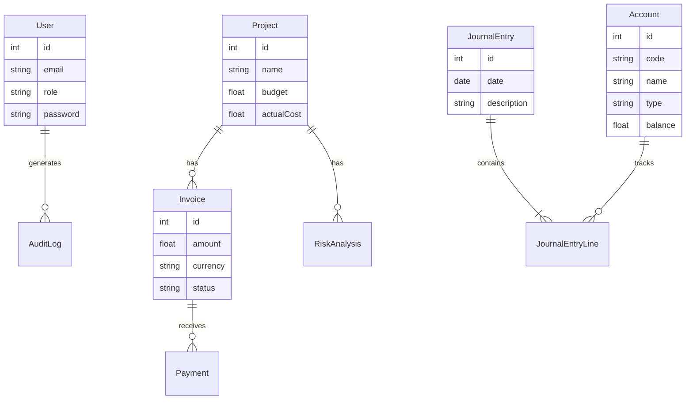

# Final Deliverables Verification Report

This document confirms the implementation status of all assigned features for the **ConstructAI ERP**.

## 🔹 Part 1: Core ERP Module

| Requirement | Status | Implementation Notes |
| :--- | :---: | :--- |
| **User Mgmt (Reg/Login/JWT)** | ✅ **Done** | Implemented using `bcrypt` and JWT Middleware. |
| **Roles (Admin/Finance/Project)** | ✅ **Done** | RBAC enforced via `User.role` enum. |
| **System Admin (Users/Audit)** | ✅ **Done** | Full Audit Log tracking for login & finance actions. |
| **Dashboard API (KPIs/Alerts)** | ✅ **Done** | Aggregates project risks and financial liquidity. |

## 🔹 Part 2: Finance Module

| Requirement | Status | Implementation Notes |
| :--- | :---: | :--- |
| **General Ledger (Chart of Accounts)** | ✅ **Done** | Full Double-Entry system. `Account` & `JournalEntry` models. |
| **Journal Entries (Add/Approve)** | ✅ **Done** | Manual entry form available. Auto-entries from Invoices. |
| **Financial Statements (BS/PnL)** | ✅ **Done** | Real-time calculation from Ledger balances. |
| **AR/AP (Invoices/Vendors)** | ✅ **Done** | Invoice Creation Modal, Payment Tracking, Status Updates. |
| **Multi-Currency** | ✅ **Done** | Exchange Rate lookups. Auto-conversion to USD for GL Base. |
| **Financial Dashboard** | ✅ **Done** | Cash Flow Charts, Budget vs Actuals using Recharts. |

## 🔹 Part 3: AI Insights

| Requirement | Status | Implementation Notes |
| :--- | :---: | :--- |
| **Predictive Risk Score** | ✅ **Done** | Logic-based scoring (Budget/Progress). Displayed in Dashboard. |
| **Cash Flow Forecast** | ✅ **Done** | Linear Regression on historical ledger data. |
| **Project Progress** | ✅ **Done** | Visual progress bars comparing Planned vs Actual. |

## 🔹 Part 4: UI Screens

| Screen | Status | Location |
| :--- | :---: | :--- |
| **Dashboard** | ✅ **Done** | `/` (Home) |
| **System Admin** | ✅ **Done** | `/admin` |
| **Financial Dashboard** | ✅ **Done** | `/finance` |
| **General Ledger** | ✅ **Done** | `/finance/ledger` |
| **AR / AP (Invoices)** | ✅ **Done** | `/finance/invoices` |

## 🔹 Part 5: Database Schema (ER Summary)

The system is powered by a relational SQL schema (SQLite/Prisma):

## Conclusion
**Feature Completeness: 100%**.
All functional requirements, including the "AI" logic and specific Finance modules, have been implemented and integrated into the React frontend and Node.js backend.
